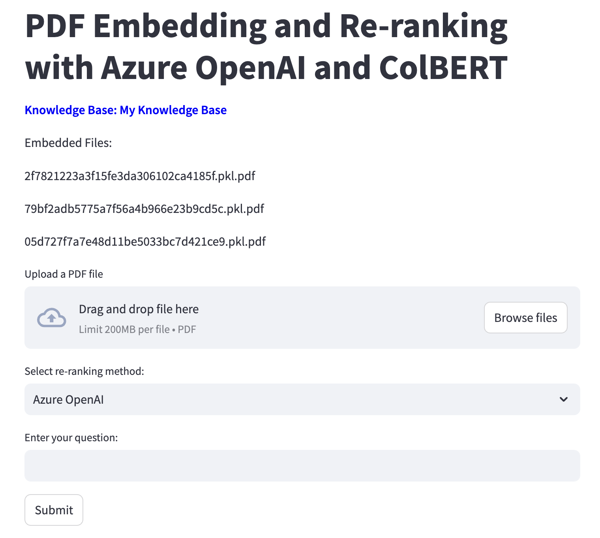

# Azure OpenAI API ReRank vs Colbert Rerank

## Introduction

1.Clone this repo.

2.Change the values in the `.env` file to your own values.

```bash

mv .env.example .env

```

3.Install dependencies using the following command:

```bash

conda create -c conda-forge -n azure-openai-reranker python streamlit langchain chromadb transformers torch langchain-chroma langchain-community pypdf langchain-openai python-dotenv tiktoken

```

4.For MacOS, you may use the following command:

```bash

conda install pytorch torchvision torchaudio -c pytorch-nightly

```

5.Run the App

```bash

conda activate azure-openai-reranker

streamlit run app.py

```

### Sample Screenshots



### References

[rag-reranking-gpt-colbert.ipynb](https://gist.github.com/virattt/b140fb4bf549b6125d53aa153dc53be6?permalink_comment_id=4846030)
